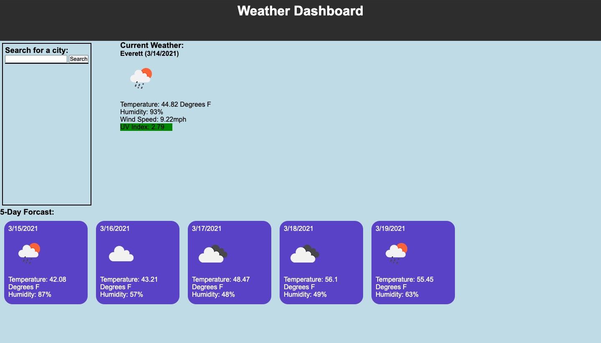

# Weather Dashboard

## Description
For this project I have created a weather dashboard using the OpenWeather API. When the user searches a city, they are presented with the current forcast and a five day forcast for that city. Forcast features include a weather icon, temperature, humidity, wind speed and uv index. 
--
## Demo
 
--
## Challenges 
My biggest challenge with this project was the local storage aspect. The goal was to have a persistent search history of the recently searched cities. I was unable to get this to work. I also struggled with the UV index, but ultimitely got that working.
--
## Deployment Link
https://kirmarnel.github.io/weather-dash/